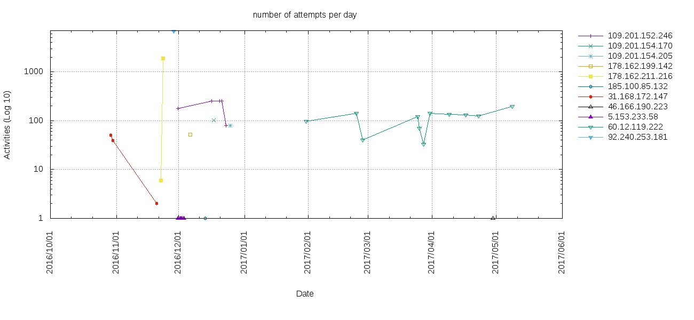

# aiki.go background.

> *Aiki is a Japanese martial arts principle or tactic in which the defender
> blends (without clashing) with the attacker[...] One applies Aiki by
> understanding the rhythm and intent of the attacker to find the optimal position
> and timing to apply a counter-technique.*
>
> *In Japanese Aiki is formed from two kanji:*
>
>  合
>  : *ai - joining*
>
>  氣
>  : *ki - spirit*


aiki.go functionality:

 - Pretend to be a SSH service.
 - Bots will try to log in with a username and password.
 - Automatically try to log in to the attacking system's SSH service using the same username and password.


For the complete background story to aiki.go, please see the
[European Cyber Security Perspectives 2017, page 28-31](https://corporate.kpn.com/web/file?uuid=19ded687-0a42-469d-93b1-6f955de73f95&owner=9ec5bf96-ba39-4279-b0ea-370b7cd47698&contentid=5406).

I have also hosted my article in the ECSP 2017 here for convenience:
[My First Golang Project](my-first-golang-project-ecsp-2017.pdf).


# aiki analysis

I analysed the results of about 8 months of running `aiki.go`.
During this time period I kept improving the code -which crashed often in the
early days- and added traps for a total of 6.
Because of all this, when it comes to "systems owned per month", only the date
range from 2017/02-2017/05/09 is somewhat representative.

So, first of all, from 2016/09/13 to 2017/05/09, how many
systems could I have possibly taken control over? A simple query shows the
(to me rather shocking) answer: **I could have hijacked 2541 systems**, ranging from servers to
IP camera's and Network Attached Storage (NAS) devices
(mostly [QNAP](https://www.qnap.com/en-us/)).

```sql
select count(distinct ip) from alltraps where state = 'success:';
2541
```

Another interesting dataset is the number of successful aiki's per day. Again,
I cannot draw too many conclusions based on this: crashing daemons, running out
of the maximum number of open files allowed and other bugs had a disproportionately
negative impact on the results.

```
sqlite3 alltraps.db "select count(distinct(ip)) as total,date from alltraps \
  where state = 'success:' group by date order by date asc;" |column -c 90

1|2016/09/14	1|2016/10/31	3|2016/12/14	1|2017/02/14	24|2017/03/30
1|2016/09/15	4|2016/11/01	2|2016/12/15	1|2017/02/15	24|2017/03/31
4|2016/09/16	6|2016/11/02	2|2016/12/16	3|2017/02/18	18|2017/04/01
1|2016/09/19	1|2016/11/03	3|2016/12/17	1|2017/02/19	24|2017/04/02
1|2016/09/20	2|2016/11/05	3|2016/12/18	1|2017/02/20	19|2017/04/03
6|2016/09/21	5|2016/11/06	1|2016/12/20	3|2017/02/21	11|2017/04/04
2|2016/09/22	3|2016/11/07	2|2016/12/21	1|2017/02/23	21|2017/04/05
1|2016/09/23	3|2016/11/08	5|2016/12/22	6|2017/02/24	56|2017/04/06
1|2016/09/24	5|2016/11/09	14|2016/12/23	8|2017/02/25	47|2017/04/07
1|2016/09/25	5|2016/11/10	14|2016/12/24	8|2017/02/26	42|2017/04/08
2|2016/09/26	4|2016/11/11	25|2016/12/25	7|2017/02/27	35|2017/04/09
1|2016/09/28	2|2016/11/12	12|2016/12/26	10|2017/02/28	41|2017/04/10
1|2016/09/29	1|2016/11/13	13|2016/12/27	10|2017/03/01	30|2017/04/11
1|2016/09/30	1|2016/11/14	14|2016/12/28	14|2017/03/02	45|2017/04/12
1|2016/10/01	1|2016/11/15	35|2016/12/29	10|2017/03/03	37|2017/04/13
3|2016/10/02	4|2016/11/16	17|2016/12/30	17|2017/03/04	52|2017/04/14
3|2016/10/03	1|2016/11/17	10|2016/12/31	11|2017/03/05	42|2017/04/15
2|2016/10/04	4|2016/11/18	5|2017/01/01	30|2017/03/06	45|2017/04/16
3|2016/10/06	3|2016/11/19	14|2017/01/02	8|2017/03/07	54|2017/04/17
2|2016/10/07	2|2016/11/20	13|2017/01/03	12|2017/03/08	28|2017/04/18
1|2016/10/08	2|2016/11/21	18|2017/01/04	17|2017/03/09	44|2017/04/19
2|2016/10/09	1|2016/11/22	7|2017/01/05	10|2017/03/10	41|2017/04/20
2|2016/10/10	2|2016/11/24	9|2017/01/06	10|2017/03/11	54|2017/04/21
4|2016/10/12	5|2016/11/25	5|2017/01/07	10|2017/03/12	43|2017/04/22
3|2016/10/13	4|2016/11/26	3|2017/01/08	10|2017/03/13	36|2017/04/23
2|2016/10/14	6|2016/11/27	7|2017/01/09	6|2017/03/14	32|2017/04/24
4|2016/10/15	2|2016/11/28	6|2017/01/10	26|2017/03/15	35|2017/04/25
1|2016/10/16	1|2016/11/29	9|2017/01/11	34|2017/03/16	35|2017/04/26
1|2016/10/17	5|2016/11/30	5|2017/01/12	26|2017/03/17	40|2017/04/27
2|2016/10/18	12|2016/12/01	1|2017/01/13	15|2017/03/18	49|2017/04/28
2|2016/10/19	13|2016/12/02	5|2017/01/30	29|2017/03/19	36|2017/04/29
2|2016/10/20	6|2016/12/03	4|2017/01/31	64|2017/03/20	39|2017/04/30
1|2016/10/21	1|2016/12/04	4|2017/02/01	43|2017/03/21	34|2017/05/01
1|2016/10/22	3|2016/12/05	2|2017/02/02	38|2017/03/22	31|2017/05/02
1|2016/10/23	2|2016/12/07	3|2017/02/03	29|2017/03/23	28|2017/05/03
1|2016/10/24	3|2016/12/08	1|2017/02/04	14|2017/03/24	30|2017/05/04
1|2016/10/26	1|2016/12/09	4|2017/02/05	53|2017/03/25	17|2017/05/05
6|2016/10/27	2|2016/12/10	3|2017/02/06	48|2017/03/26	41|2017/05/06
4|2016/10/28	1|2016/12/11	1|2017/02/07	29|2017/03/27	31|2017/05/07
4|2016/10/29	3|2016/12/12	5|2017/02/08	15|2017/03/28	36|2017/05/08
9|2016/10/30	1|2016/12/13	4|2017/02/10	18|2017/03/29	10|2017/05/09
```

Last but not least, what are the **real username/password combinations** used out there?

Below is a list of user/password combinations which gave access to the
devices attacking me. Please keep in mind that some systems will allow you to log
in with just about any username and/or password (mostly badly configured open
source media centers). I don't believe there are many honeypots polluting the results,
unless the owners allow their honeypots to attack others on the internet without impunity.
 I have added a file which can perhaps be useful during Red/Blueteam
exercises or in other tooling: [user+pass.txt (tab separated, unix lines)](user+pass.txt)

```
⠠⠵ sqlite3 alltraps.db "select count(distinct ip+pass+user) as total,user,pass
   from alltraps where state = 'success:' group by user,pass order by total
   desc;"| column -c 120

470|admin|admin				3|root|apple				2|root|peppermint
368|root|root				3|root|baseball				2|root|postgres
229|root|admin				3|root|christ				2|root|putin
137|root|123456				3|root|core				2|root|quake
81|root|000000				3|root|coreos				2|root|qwertyuiop
72|root|welc0me				3|root|database				2|root|redhat
64|pi|raspberry				3|root|ddwrt				2|root|router
63|root|openelec			3|root|deepin				2|root|security
60|root|1234				3|root|docker				2|root|snowboard
53|root|password			3|root|drugs				2|root|solus
48|root|12345				3|root|freebsd				2|root|t0talc0ntr0l4!
44|root|dreambox			3|root|gentoo				2|root|tails
43|root|111111				3|root|hacker				2|root|ubuntu
42|ubnt|ubnt				3|root|kali				2|root|xbmc
41|root|anko				3|root|linux				2|root|zentyal
41|root|ubnt				3|root|mate				2|root|zxcvbnm
38|root|0000				3|root|mysql				2|user|public
36|root|nosoup4u			3|root|neon				2|vyatta|vyatta
36|root|seiko2005			3|root|opensuse				1|123|123
36|root|xmhdipc				3|root|oracle				1|admin|000000
35|root|system				3|root|penis				1|admin|1111111
34|root|raspberrypi			3|root|puppy				1|admin|12345678
34|root|waldo				3|root|qwerty1234			1|admin|123456789
33|root|admintrup			3|root|rancher				1|admin|1qazse4
33|root|uClinux				3|root|redrum				1|admin|2wsxdr5
29|root|rpitc				3|root|same				1|admin|5tgb6yhn
21|admin|1234				3|root|satan				1|admin|administrator
19|admin|password			3|root|slackware			1|admin|centos
18|support|support			3|root|suse				1|admin|meinsm
17|oracle|oracle			3|root|toor				1|admin|pass
12|admin|admin1				3|root|true				1|admin|ubuntu
12|root|root123				3|root|trueos				1|admln|kopet123
12|user|user				3|root|trustix				1|applmgr|applmgr
11|root|888888				3|root|vizxv				1|arita|arita
10|admin|12345				3|root|whore				1|boot|123456
10|admin|admin123			3|root|wrt				1|chris|chris123
10|root|54321				3|root|xc3511				1|core|core
10|root|default				3|root|zabbix				1|dev|dev
9|test|test				3|root|zlxx				1|ftp|ftp123
8|root|Admin123				3|root|zorin				1|ftpuser|ftpuser
8|root|raspberry			3|steam|steam				1|guest|1234
8|root|zlxx.				3|ubuntu|ubuntu				1|hadoop|hadoop
7|guest|guest				2|Admin|Admin				1|lw|lw
7|root|abc123				2|admin|				1|manager|manager
7|root|klv123				2|admin|1				1|marian|marian
6|admin|7ujMko0admin			2|administrator|password		1|monitor|monitor
6|admin|default				2|backup|backup				1|naike|q
6|ftpuser|asteriskftp			2|cisco|cisco				1|newadmin|newadmin
6|root|666666				2|debian|debian				1|nobody|123456
6|root|Zte521				2|mother|fucker				1|nobody|password
6|root|hi3518				2|mysql|mysql				1|pos|pos
6|root|ikwb				2|rancher|rancher			1|postgres|andrei2t22t
6|root|jvbzd				2|root|102030				1|postgres|georgexxl9966
6|root|pfsense				2|root|1234567				1|postgres|postgrespostgres
6|root|root1234				2|root|12345678				1|prueba|prueba
6|root|server				2|root|1488				1|root|!Q@W#E$R%T
6|root|user				2|root|1qazse4				1|root|!QAZ2wsx
6|usuario|usuario			2|root|3edCft6				1|root|##eoeo123!
5|debian|temppwd			2|root|3edcft6				1|root|#qlalf#wjsqnr!@
5|ftp|ftp				2|root|4rfVgy7				1|root|1234@ABCD
5|nobody|nobody				2|root|4rfvgy7				1|root|15j4h8y-ob
5|osmc|osmc				2|root|5tgb6yhn				1|root|2444666668888888000000000
5|root|(none)				2|root|5tgbhu8				1|root|3e2w1q
5|root|00000000				2|root|6yhNji9				1|root|6y5t4r3e2w1q
5|root|1				2|root|7ujMko0				1|root|Accelserverroot
5|root|7ujMko0vizxv			2|root|7ujm8ik,				1|root|India123
5|root|alpine				2|root|anal				1|root|P@ssw0rd
5|root|juantech				2|root|antergos				1|root|PWLA-root
5|root|qwerty				2|root|arch				1|root|Pass2017
5|root|realtek				2|root|asdfghjkl			1|root|Pr!vat3Sh3llAcc3sS
4|PlcmSpIp|PlcmSpIp			2|root|batman				1|root|Qwe123!@#
4|admin|admin1234			2|root|beer				1|root|ROOT@123
4|root|1111				2|root|blowjob				1|root|Test1234
4|root|1q2w3e4r				2|root|calvin				1|root|YtzEKU4GUMN1vl
4|root|1q2w3e4r5t6y7u8i9o0p		2|root|centos				1|root|Zaq12wsx
4|root|2wsxdr5				2|root|centos6svm			1|root|jasambudala
4|root|6yhn7ujm				2|root|cocaine				1|root|qkrrud7502
4|root|klv1234				2|root|darknet				1|root|root1
4|root|korora				2|root|death				1|root|tyxk123
4|root|pass				2|root|debian				1|root|ucloud.cn
4|root|sunwah				2|root|dev				1|root|zhaowei@123.com
4|root|vagina				2|root|dup				1|scanner|scanner
3|admin|123456				2|root|empty				1|service|service
3|bin|bin				2|root|fedora				1|services|services
3|butter|xuelp123			2|root|football				1|shipping|shipping
3|git|git				2|root|fuck				1|support|12345
3|mail|mail				2|root|god				1|system|system
3|nagios|nagios				2|root|godblessamerica			1|tes|tes
3|postgres|postgres			2|root|hadoop				1|test|test123
3|root|					2|root|iphone				1|test|test@123
3|root|0987654321			2|root|ironmman				1|test1|test1
3|root|1qaZse4				2|root|jesus				1|toor|root
3|root|1qaz2wsx				2|root|kaos				1|trial|trial
3|root|2wsXdr5				2|root|knoppix				1|ts3server|ts3
3|root|2wsx3edc				2|root|letmein				1|user|123456
3|root|3edc4rfv				2|root|mageia				1|user|pass
3|root|4rfv5tgb				2|root|mandriva				1|user1|1234
3|root|5tgBhu8				2|root|mint				1|user1|123456
3|root|6yhnji9				2|root|obama				1|vagrant|vagrant
3|root|7ujMko0admin			2|root|openssh				1|vncuser|vncuser
3|root|Passw0rd				2|root|openvpnas			1|vyos|vyos
3|root|Swiss123				2|root|openwrt				1|wawan|wawan
3|root|android				2|root|pa55w0rd				1|www-data|www-data
```

## JAR-16-20296

On October 7, 2016 the DHS and DNI released the [GRIZZLY STEPPE](https://www.us-cert.gov/security-publications/GRIZZLY-STEPPE-Russian-Malicious-Cyber-Activity)
report documenting "Russian malicious cyber activity".
Interestingly, I actually had a number of IP addresses contained in the JAR CSV attacking
my aiki traps. I skipped any Tor exit nodes (based on a
[list](https://docs.google.com/spreadsheets/d/1wJkecEHnNfOr7AOvdh1XPJQv43rps0cpVfcJVubmWWU/pubhtml)
by @jgamblin ([Jerry Gamblin](https://twitter.com/JGamblin)) during his
[investigation](https://jerrygamblin.com/2016/12/30/grizzly-steppe-ip-and-hash-analysis/)).
I solely looked at the systems which were not (immediately identifiable as a) tor
exit node. In total my honeypots were attacked by 11 non-Tor IP addresses listed in the JAR release.

```sql
⠠⠵ sqlite alltraps.db 'select distinct(ip) from jarresults'
178.162.199.142
109.201.154.170
60.12.119.222
31.168.172.147
178.162.211.216
92.240.253.181
109.201.152.246
109.201.154.205
5.153.233.58
185.100.85.132
46.166.190.223
```

I could not resist checking whether I *pwnd* any of these infamous systems.
I found one IP address from the JAR list for which I have credentials.
I'm not going to disclose the IP address (although a smart cookie can probably work it out)
but what I can say is this: Both Shodan.io and I agree that this is not a very sexy Russian jumpbox.
This is a piece of badly configured webmin/cacti nightmare
haunting the interwebs. Bad guys of all types will probably have repurposed it
multiple times to do their bidding.

Having said that, was it doing anything which makes me
think the Russians were using it to scan the traps? Absolutely not.

```
select count(user) as cnt,user,pass,info from jarresults where ip = 'nn.nn.nn.nn'
and state = 'attempt:' group by user,pass order by cnt desc;

59	admin	password	SSH-2.0-sshlib-0.1
55	admin	12345	SSH-2.0-sshlib-0.1
49	admin	1234	SSH-2.0-sshlib-0.1
49	root	welc0me	SSH-2.0-sshlib-0.1
48	root	system	SSH-2.0-sshlib-0.1
47	admin	admin1	SSH-2.0-sshlib-0.1
47	admin	admin123	SSH-2.0-sshlib-0.1
46	root	anko	SSH-2.0-sshlib-0.1
46	root	nosoup4u	SSH-2.0-sshlib-0.1
45	root	waldo	SSH-2.0-sshlib-0.1
44	root	1234	SSH-2.0-sshlib-0.1
44	root	password	SSH-2.0-sshlib-0.1
43	root	111111	SSH-2.0-sshlib-0.1
43	root	admin	SSH-2.0-sshlib-0.1
43	root	dreambox	SSH-2.0-sshlib-0.1
43	root	root	SSH-2.0-sshlib-0.1
42	admin	admin1234	SSH-2.0-sshlib-0.1
40	root	0000	SSH-2.0-sshlib-0.1
39	root	123456	SSH-2.0-sshlib-0.1
39	root	openelec	SSH-2.0-sshlib-0.1
39	root	seiko2005	SSH-2.0-sshlib-0.1
38	root	12345	SSH-2.0-sshlib-0.1
38	root	raspberrypi	SSH-2.0-sshlib-0.1
38	root	uClinux	SSH-2.0-sshlib-0.1
37	root	rpitc	SSH-2.0-sshlib-0.1
36	root	ubnt	SSH-2.0-sshlib-0.1
34	admin	admin	SSH-2.0-sshlib-0.1
32	root	000000	SSH-2.0-sshlib-0.1
31	root	xmhdipc	SSH-2.0-sshlib-0.1
```

Although I think all of this is rather disappointing, perhaps someone with more
insight into what is running behind these IPs can glean something from the pattern
of attacks over time. So this is what I have:



```sql
select date,count(date),ip from jarresults where state = 'attempt:' group by date,ip;
2016/10/30	51	31.168.172.147
2016/10/31	39	31.168.172.147
2016/11/21	2	31.168.172.147
2016/11/23	6	178.162.211.216
2016/11/24	1893	178.162.211.216
2016/11/29	6904	92.240.253.181
2016/12/01	180	109.201.152.246
2016/12/01	1	5.153.233.58
2016/12/02	1	5.153.233.58
2016/12/03	1	5.153.233.58
2016/12/04	1	5.153.233.58
2016/12/07	52	178.162.199.142
2016/12/14	1	185.100.85.132
2016/12/17	255	109.201.152.246
2016/12/18	102	109.201.154.170
2016/12/21	255	109.201.152.246
2016/12/22	255	109.201.152.246
2016/12/24	80	109.201.152.246
2016/12/26	80	109.201.154.205
2017/01/31	97	60.12.119.222
2017/02/24	141	60.12.119.222
2017/02/27	40	60.12.119.222
2017/03/25	122	60.12.119.222
2017/03/26	70	60.12.119.222
2017/03/28	33	60.12.119.222
2017/03/31	141	60.12.119.222
2017/04/09	134	60.12.119.222
2017/04/17	133	60.12.119.222
2017/04/23	126	60.12.119.222
2017/04/30	1	46.166.190.223
2017/05/09	197	60.12.119.222
```

# aiki.go setup and configuration

## code patches

Two patches were needed to make the ssh daemon work with all the buggy
brute force clients (and IoT) devices out there.

The first was a patch to server.go, because ssh brute force clients surprisingly
do not respect the maxTries option:

```diff
 	sessionID := s.transport.getSessionID()
 	var cache pubKeyCache
 	var perms *Permissions
+	// addition to break after maxTries
+	var count = 0
+	const maxTries = 3
 
 userAuthLoop:
 	for {
@@ -305,6 +308,12 @@ userAuthLoop:
 			}
 
 			perms, authErr = config.PasswordCallback(s, password)
+			// addition to break after maxTries
+			if count >= maxTries {
+				authErr = errors.New("ssh: maxTries reached")
+				break
+			}
+			count += 1

 		case "keyboard-interactive":
 			if config.KeyboardInteractiveCallback == nil {
 				authErr = errors.New("ssh: keyboard-interactive auth not configubred")
```


The other was a patch the ssh client in go, because ubiquity devices run with
terribly bad cypher suites, which prevented me from logging in:

```diff
 var supportedCiphers = []string{
 	"aes128-ctr", "aes192-ctr", "aes256-ctr",
 	"aes128-gcm@openssh.com",
-	"arcfour256", "arcfour128",
+	"arcfour256", "arcfour128", "aes128-cbc",
 }
 
```

## running aiki

```bash
./aiki-linux-amd64
```

or

```bash
go run aiki.go
```

You will probably want to run this as an unprivileged process (I just did it YOLO style as root on some DigitalOcean instances):

```bash
sysctl -w net.ipv4.conf.eth0.route_localnet=1
iptables -t nat -I PREROUTING -p tcp --dport 22 -j DNAT --to 127.0.0.1:2222
iptables -t nat -A OUTPUT -p tcp -o lo --dport 22 -j REDIRECT --to-ports 2222
```

## running into "too many open files"

Once I managed to get my daemon working in non-blocking Listen mode,
another problem revealed itself: "*too many open files*" was killing all
my instances. I figured it had to do with sloppy coding. And it did.
However, fixing that bug (`go func(tcpConn net.Conn) {...}(tcpConn)`, not `go func() {...}()`)
actually seemed to aggravate the issue.

So, for a running instance, I did:

```bash
cat /proc/$(pgrep -f aiki-linux-amd64)/limits |\
egrep 'Limit|files'

Limit               Soft Limit  Hard Limit     Units
Max open files      1024        65536          files
```

1024 was not going to cut it with some of these bots.
https://easyengine.io/tutorials/linux/increase-open-files-limit/ gave
some good examples of how to fix this issue.

```bash
# cat /proc/sys/fs/file-max
48216
# vim /etc/sysctl.conf
# sysctl -p
fs.file-max = 2097152
# cat /proc/sys/fs/file-max
2097152
```

Then for the soft limits, add this:

```bash
⠠⠵ grep -v ^# /etc/security/limits.conf

*         hard    nofile      500000
*         soft    nofile      500000
root      hard    nofile      500000
root      soft    nofile      500000
```

### creating aiki.log

```bash
tail --retry --follow=name -F /var/log/syslog |\
grep --line-buffered aiki >> aiki.log
```

# disclaimer

This software has been created purely for the purposes of academic research and for the development
of effective defensive techniques, and is not intended to be used to attack systems except where
explicitly authorized. Project maintainers are not responsible or liable for misuse of the software.
Use responsibly.
